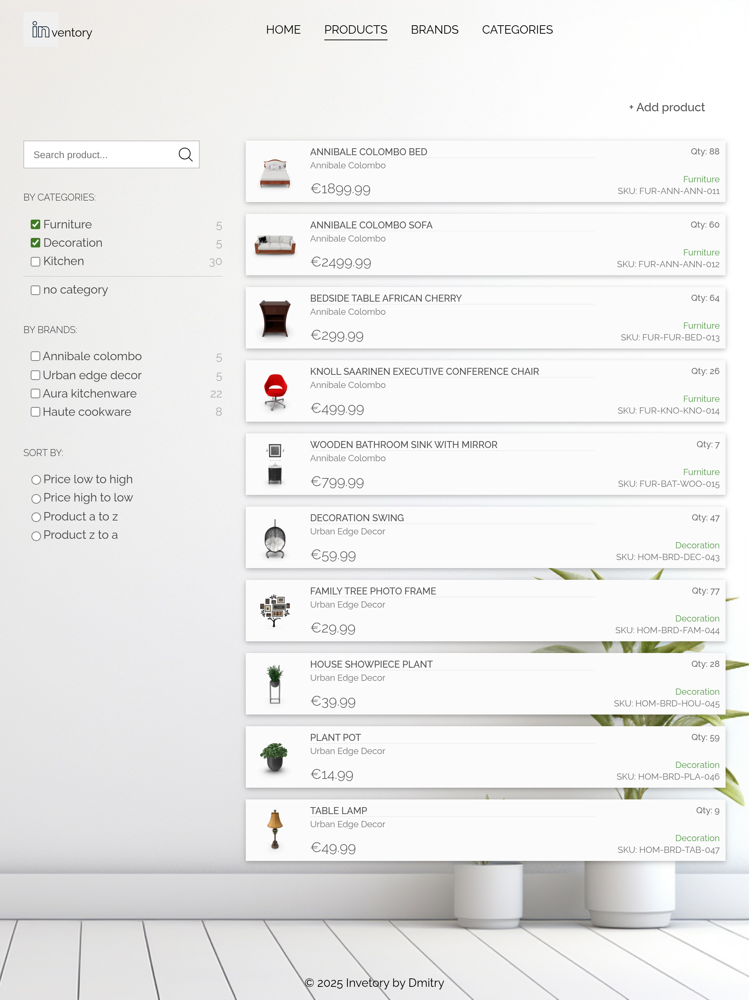
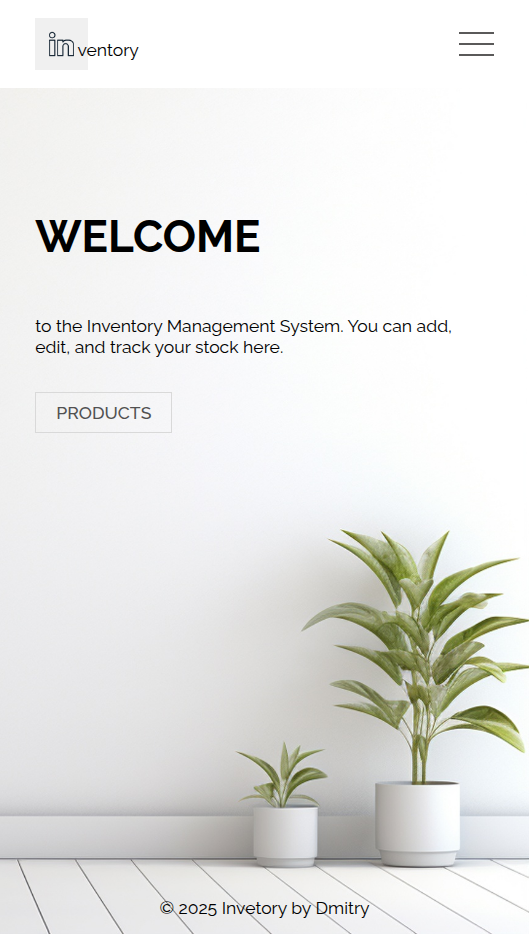

# Inventory Application

[Live Version](https://) 

A full-stack (backend-focused) home store inventory management application built with the following tech stack:

**Frontend:**  
- EJS templates
- Styling: CSS   

**Backend:**  
- Node.js, Express  
- Database: PostgreSQL

 ## Features
- Allows you to **add**, **delete**, **update**, and **view** all products, brands and categories
- **MVC** architecture, ensuring clean and maintainable code
- Robust validation with **express-validator**
- Allows you to search, filter and sort products
- Parameterized SQL queries (SQL injection safe)
- Minimal, responsive UI

## Screenshots
<table border="1" style="width:100%">
  <tr>
    <td rowspan="4"></td>
    <td></td>
  </tr>
  <tr>
    <td></td>
  </tr> 
</table>

## Acknowledgements

- [Dummyjson](https://dummyjson.com/) for products data
- [Freepik](www.freepik.com) for the background and default product images
